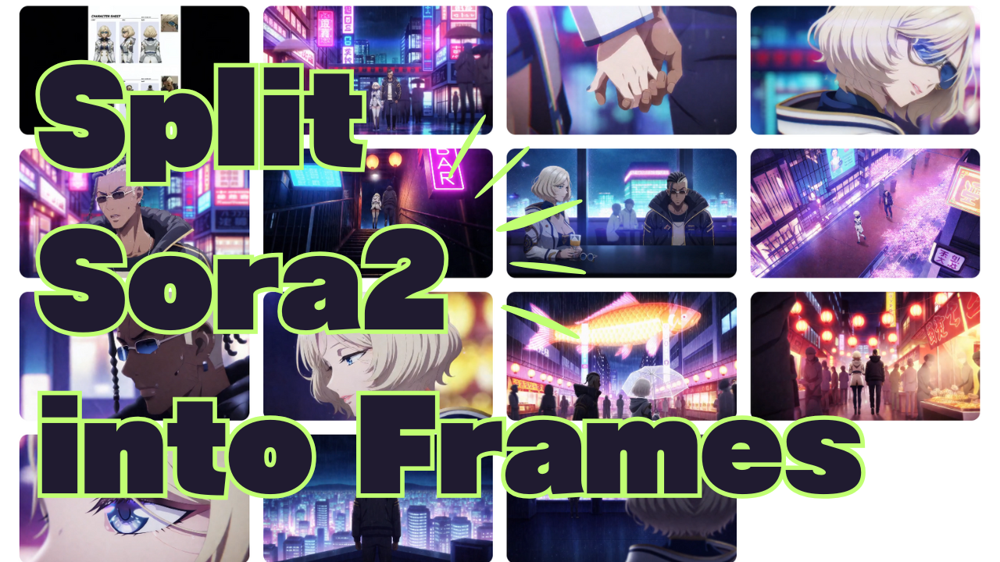

# Sora2 Frame Splitter

<!-- English -->
**Detect scene changes in videos and extract keyframes automatically**

<!-- Japanese -->
動画からシーン検出を行い、各ショットの先頭フレームを自動抽出するWebアプリケーションです。



[](https://vercel.com/yazoo1220s-projects/v0-video-scene-detector)

## Overview / 概要

<!-- English -->
Sora2 Frame Splitter is a web application that automatically detects scene changes in uploaded videos and extracts keyframes from each scene. All processing is done in your browser, so video files are never sent to external servers.

<!-- Japanese -->
Sora2 Frame Splitterは、動画をアップロードすると、シーンの変化を自動的に検出してフレームを抽出するツールです。すべての処理はブラウザ内で完結するため、動画ファイルが外部に送信されることはありません。

## Features / 主な機能

- 🎬 **Scene Detection / シーン自動検出**: Automatically detects scene changes in videos / 動画内のシーン変化を自動的に検出
- 📸 **Frame Extraction / フレーム抽出**: Extracts keyframes from each scene / 各シーンの先頭フレームを自動抽出
- 🎚️ **Sensitivity Adjustment / 感度調整**: Adjustable detection sensitivity via slider / スライダーでシーン検出の感度を調整可能
- 💾 **Individual Download / 個別ダウンロード**: Download extracted frames individually / 抽出されたフレームを個別にダウンロード可能
- 🌐 **Multi-language Support / 日本語・英語対応**: Switch between Japanese and English interface / 日本語と英語のインターフェースを切り替え可能
- 🔒 **Privacy-focused / プライバシー重視**: All processing done in browser / すべての処理がブラウザ内で完結

## Usage / 使い方

<!-- English -->
1. **Upload Video**: Drag & drop a video file or click the button to select a file
2. **Adjust Sensitivity**: Use the slider to adjust scene detection sensitivity (recommended: 0.20)
3. **Start Extraction**: Click the "Start Extraction" button
4. **Download Frames**: Click each extracted frame to download

<!-- Japanese -->
1. **動画をアップロード**: 動画ファイルをドラッグ&ドロップ、またはファイル選択ボタンから動画を選択
2. **感度を調整**: シーン検出の感度をスライダーで調整（推奨値: 0.20）
3. **抽出スタート**: 「抽出スタート」ボタンをクリック
4. **フレームをダウンロード**: 抽出されたフレームをクリックしてダウンロード

### Sensitivity Settings / 感度設定の目安

<!-- English -->
- **0.10**: Sensitive - detects small changes
- **0.20**: Standard - balanced detection
- **0.35**: Strict - only major changes

<!-- Japanese -->
- **0.10**: 敏感 - 小さな変化も検出
- **0.20**: 標準 - バランスの取れた検出
- **0.35**: 厳選 - 大きな変化のみ検出

## Tech Stack / 技術スタック

- **Framework / フレームワーク**: Next.js 16.0.0
- **Language / 言語**: TypeScript
- **UI**: React 19.2.0
- **Styling / スタイリング**: Tailwind CSS 4.1.9
- **UI Components / UIコンポーネント**: Radix UI
- **Icons / アイコン**: Lucide React

## Development Setup / 開発環境のセットアップ

```bash
# Install dependencies / 依存関係のインストール
pnpm install

# Start development server / 開発サーバーの起動
pnpm dev

# Build / ビルド
pnpm build

# Start production server / 本番起動
pnpm start
```

## Deployment / 配布

<!-- English -->
Deployed application:

<!-- Japanese -->
デプロイされたアプリケーション:

**[https://vercel.com/yazoo1220s-projects/v0-video-scene-detector](https://vercel.com/yazoo1220s-projects/v0-video-scene-detector)**

## Author / 作者

Created by [Yachimat](https://x.com/yachimat_manga)

## License / ライセンス

<!-- English -->
This project is licensed under the MIT License.

<!-- Japanese -->
このプロジェクトはMITライセンスの下で公開されています。
